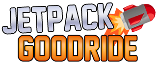

A Jetpack Joyride clone in **pygame**.\
This game was made for **learning purpose only**.

[Demo video (pt-BR)](https://www.youtube.com/watch?v=AGmhM9LWP6g)

 

***

## Screenshots
<table>
  <tr>
    <td></td>
    <td></td>
  </tr>
  <tr>
    <td></td>
    <td></td>
  </tr>
</table>

 

## Controls
<table>
  <tr>
    <td><b>Key</b></td>
    <td><b>Action</b></td>
  </tr>
  <tr>
    <td>W</td>
    <td>Fly</td>
  </tr>
  <tr>
    <td>Esc</td>
    <td>Pause</td>
  </tr>
</table>

 

## How to run the game:

### Option 1:
1) Download the latest release.
2) Run the executable.

### Option 2:
1) Clone the repository.
2) Install Python 3.8.8 or higher.
3) Run Initialize.bat.

### Option 3:
1) Clone the repository.
2) Install Python 3.8.8 or higher.
3) Install the packages in <b>requirements.txt</b>, using the following command in the terminal in the game folder: <b>pip install -r requirements.txt</b>
4) Run main.py file using <b>python main.py</b> in terminal.

 

## Credits

Programming, GUI and logo by **GustavoPauli**. \
https://github.com/Gustavo-Pauli

Art mainly done by **DarkLava**. \
https://scratch.mit.edu/users/DarkLava/

New Athletic M54 font by **justme54s**. \
https://www.dafont.com/new-athletic-m54.font

Soundtrack by **dos88**. \
https://dos88.itch.io/dos-88-music-library

Go checkout the real **Jetpack Joyride**! \
https://www.halfbrick.com/games/jetpack-joyride
